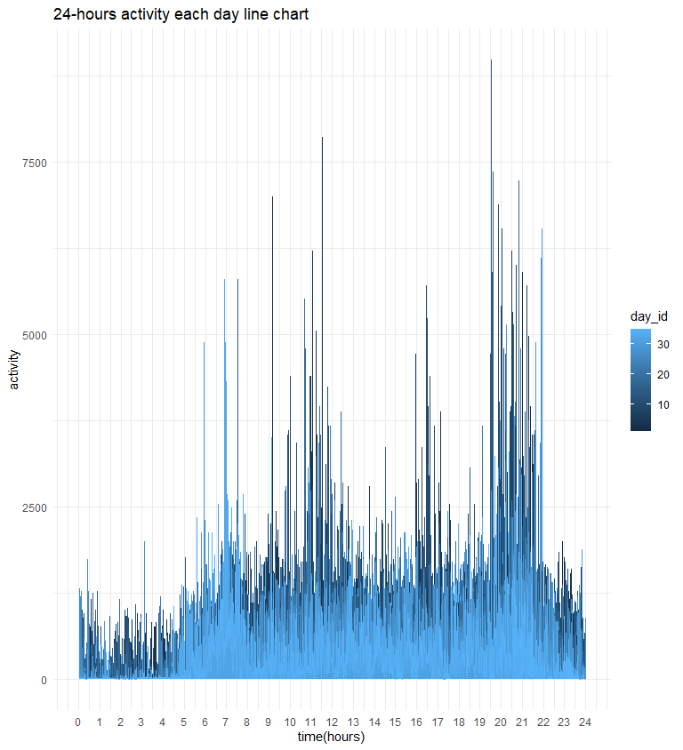

p8105\_hw3\_yk2960
================
Youyuan(Keviant) Kong
2021/10/15

## Problem 1

``` r
##p8105.datasets::brfss_smart2010
data("instacart")
##data("brfss_smart2010")
##distinct(instacart,eval_set)
##distinct(instacart,order_number)
##force(instacart)
a<-instacart %>%
  group_by(order_number) %>%
  summarize(
    n_obs = n(),
    n_days = n_distinct(user_id))


head(instacart,1)
```

    ## # A tibble: 1 x 15
    ##   order_id product_id add_to_cart_order reordered user_id eval_set order_number
    ##      <int>      <int>             <int>     <int>   <int> <chr>           <int>
    ## 1        1      49302                 1         1  112108 train               4
    ## # ... with 8 more variables: order_dow <int>, order_hour_of_day <int>,
    ## #   days_since_prior_order <int>, product_name <chr>, aisle_id <int>,
    ## #   department_id <int>, aisle <chr>, department <chr>

``` r
##  filter(order_id==)
```

### Description(Q1.0)

The dataset’s size is 15 columns× 1384617 rows. </br> It has 15
variables, which are:</br> order\_id, product\_id, add\_to\_cart\_order,
reordered, user\_id, eval\_set, order\_number, order\_dow,
order\_hour\_of\_day, days\_since\_prior\_order, product\_name,
aisle\_id, department\_id, aisle, department </br> In these variables,
order\_id: order identifier</br> product\_id: product identifier</br>
add\_to\_cart\_order: order in which each product was added to cart
reordered: 1 if this prodcut has been ordered by this user in the past,
0 otherwise</br> user\_id: customer identifier</br> eval\_set: which
evaluation set this order belongs in (Note that the data for use in this
class is exclusively from the “train” eval\_set)</br> order\_number: the
order sequence number for this user (1=first, n=nth)</br> order\_dow:
the day of the week on which the order was placed</br>
order\_hour\_of\_day: the hour of the day on which the order was
placed</br> days\_since\_prior\_order: days since the last order, capped
at 30, NA if order\_number=1</br> product\_name: name of the
product</br> aisle\_id: aisle identifier</br> department\_id: department
identifier</br> aisle: the name of the aisle</br> department: the name
of the department</br> Here is one example for the dataset and shows the
type for each variable

| order\_id | product\_id | add\_to\_cart\_order | reordered | user\_id | eval\_set | order\_number | order\_dow | order\_hour\_of\_day | days\_since\_prior\_order | product\_name    | aisle\_id | department\_id | aisle  | department |
|----------:|------------:|---------------------:|----------:|---------:|:----------|--------------:|-----------:|---------------------:|--------------------------:|:-----------------|----------:|---------------:|:-------|:-----------|
|         1 |       49302 |                    1 |         1 |   112108 | train     |             4 |          4 |                   10 |                         9 | Bulgarian Yogurt |       120 |             16 | yogurt | dairy eggs |

The next code shows the example’s each variable and its class.</br> The
department, aisle and product\_name’s type is character, the others are
integer.

``` r
str(head(instacart, 1))
```

    ## tibble [1 x 15] (S3: tbl_df/tbl/data.frame)
    ##  $ order_id              : int 1
    ##  $ product_id            : int 49302
    ##  $ add_to_cart_order     : int 1
    ##  $ reordered             : int 1
    ##  $ user_id               : int 112108
    ##  $ eval_set              : chr "train"
    ##  $ order_number          : int 4
    ##  $ order_dow             : int 4
    ##  $ order_hour_of_day     : int 10
    ##  $ days_since_prior_order: int 9
    ##  $ product_name          : chr "Bulgarian Yogurt"
    ##  $ aisle_id              : int 120
    ##  $ department_id         : int 16
    ##  $ aisle                 : chr "yogurt"
    ##  $ department            : chr "dairy eggs"
    ##  - attr(*, "spec")=
    ##   .. cols(
    ##   ..   order_id = col_integer(),
    ##   ..   product_id = col_integer(),
    ##   ..   add_to_cart_order = col_integer(),
    ##   ..   reordered = col_integer(),
    ##   ..   user_id = col_integer(),
    ##   ..   eval_set = col_character(),
    ##   ..   order_number = col_integer(),
    ##   ..   order_dow = col_integer(),
    ##   ..   order_hour_of_day = col_integer(),
    ##   ..   days_since_prior_order = col_integer(),
    ##   ..   product_name = col_character(),
    ##   ..   aisle_id = col_integer(),
    ##   ..   department_id = col_integer(),
    ##   ..   aisle = col_character(),
    ##   ..   department = col_character()
    ##   .. )

### Number of Aisles(Q1.1)

*comment:I group this dataset by aisle and arrange it by the amount of
items.*

``` r
aisle<-instacart %>%
  group_by(aisle,aisle_id) %>%
  summarize(n_items = n()) %>% 
  arrange(desc(n_items))
```

    ## `summarise()` has grouped output by 'aisle'. You can override using the `.groups` argument.

``` r
##    n_days = n_distinct(user_id))
```

There are134 aisles, and the most popular one is fresh vegetables

### 10000 Items’ Aisle(Q1.2)

*comment: first find the aisles whose number of items is more than
10000,then show the reasonable plot.(bar chart is more readable than
point chart)*

``` r
aisle_ggplot<-
  aisle %>% 
  filter(n_items>10000) %>% 
  ggplot(aes(x = aisle,y=n_items))+
  geom_col(width=0.5) + 
  coord_flip()+
##  facet_grid(. ~ aisle_id)+ 
  labs(
    title = "Aisle Top 10 plot",
    x = "aisle ID",
    y = "number of items")

##
aisle_ggplot
```


\#\#\# Top 3 (Q1.3) *comment:find the three key aisles from the dataset*

``` r
three_aisle<-instacart %>% 
  filter(aisle=="baking ingredients"| 
           aisle=="dog food care"| 
           aisle=="packaged vegetables fruits")
```

*comment:group the newdataset first and then count the items and rank
them,finally show the table. *

``` r
three_aisle %>%
  group_by(aisle,product_name) %>%
  summarize(n_items = n()) %>% 
  arrange(desc(n_items)) %>% 
  mutate(rank=order(n_items, decreasing = TRUE)) %>% 
  filter(order(n_items, decreasing = TRUE)<=3) %>% 
  knitr::kable()
```

    ## `summarise()` has grouped output by 'aisle'. You can override using the `.groups` argument.

| aisle                      | product\_name                                 | n\_items | rank |
|:---------------------------|:----------------------------------------------|---------:|-----:|
| packaged vegetables fruits | Organic Baby Spinach                          |     9784 |    1 |
| packaged vegetables fruits | Organic Raspberries                           |     5546 |    2 |
| packaged vegetables fruits | Organic Blueberries                           |     4966 |    3 |
| baking ingredients         | Light Brown Sugar                             |      499 |    1 |
| baking ingredients         | Pure Baking Soda                              |      387 |    2 |
| baking ingredients         | Cane Sugar                                    |      336 |    3 |
| dog food care              | Snack Sticks Chicken & Rice Recipe Dog Treats |       30 |    1 |
| dog food care              | Organix Chicken & Brown Rice Recipe           |       28 |    2 |
| dog food care              | Small Dog Biscuits                            |       26 |    3 |

### Pink Lady Apples and Coffee Ice Cream(Q1.4)

*comment:Use pivot wider to change the table from 3x7 to 7x3(I think it
is more readable), I also change the order\_dow number to actual
weekday.*

``` r
instacart %>% 
  filter(product_name=="Pink Lady Apples"|
         product_name=="Coffee Ice Cream") %>% 
  group_by(order_dow,product_name) %>% 
  summarize(mean_hours = mean(order_hour_of_day)) %>% 
  pivot_wider(names_from=product_name,values_from =mean_hours ) %>%
  janitor::clean_names()%>% 
  mutate(order_dow=
         recode(order_dow,
                "0"="Sunday",
                "1"="Monday",
                "2"="Tuesday",
                "3"="Wednesday",
                "4"="Thursday",
                "5"="Friday",
                "6"="Saturday")) %>% 
  knitr::kable()
```

    ## `summarise()` has grouped output by 'order_dow'. You can override using the `.groups` argument.

    ## Warning in FUN(X[[i]], ...): strings not representable in native encoding will
    ## be translated to UTF-8

    ## Warning in FUN(X[[i]], ...): unable to translate '<U+00C4>' to native encoding

    ## Warning in FUN(X[[i]], ...): unable to translate '<U+00D6>' to native encoding

    ## Warning in FUN(X[[i]], ...): unable to translate '<U+00E4>' to native encoding

    ## Warning in FUN(X[[i]], ...): unable to translate '<U+00F6>' to native encoding

    ## Warning in FUN(X[[i]], ...): unable to translate '<U+00DF>' to native encoding

    ## Warning in FUN(X[[i]], ...): unable to translate '<U+00C6>' to native encoding

    ## Warning in FUN(X[[i]], ...): unable to translate '<U+00E6>' to native encoding

    ## Warning in FUN(X[[i]], ...): unable to translate '<U+00D8>' to native encoding

    ## Warning in FUN(X[[i]], ...): unable to translate '<U+00F8>' to native encoding

    ## Warning in FUN(X[[i]], ...): unable to translate '<U+00C5>' to native encoding

    ## Warning in FUN(X[[i]], ...): unable to translate '<U+00E5>' to native encoding

| order\_dow | coffee\_ice\_cream | pink\_lady\_apples |
|:-----------|-------------------:|-------------------:|
| Sunday     |           13.77419 |           13.44118 |
| Monday     |           14.31579 |           11.36000 |
| Tuesday    |           15.38095 |           11.70213 |
| Wednesday  |           15.31818 |           14.25000 |
| Thursday   |           15.21739 |           11.55172 |
| Friday     |           12.26316 |           12.78431 |
| Saturday   |           13.83333 |           11.93750 |

*comment:2x7 table is here:*

``` r
instacart %>% 
  filter(product_name %in%
           c("Coffee Ice Cream","Pink Lady Apples")) %>% 
  group_by(order_dow,product_name) %>% 
  summarize(mean_hours = mean(order_hour_of_day)) %>% 
  janitor::clean_names()%>% 
  mutate(order_dow=
         recode(order_dow,
                "0"="Sunday",
                "1"="Monday",
                "2"="Tuesday",
                "3"="Wednesday",
                "4"="Thursday",
                "5"="Friday",
                "6"="Saturday")) %>% 
  pivot_wider(names_from=order_dow,values_from =mean_hours) %>%
  knitr::kable()
```

    ## `summarise()` has grouped output by 'order_dow'. You can override using the `.groups` argument.

| product\_name    |   Sunday |   Monday |  Tuesday | Wednesday | Thursday |   Friday | Saturday |
|:-----------------|---------:|---------:|---------:|----------:|---------:|---------:|---------:|
| Coffee Ice Cream | 13.77419 | 14.31579 | 15.38095 |  15.31818 | 15.21739 | 12.26316 | 13.83333 |
| Pink Lady Apples | 13.44118 | 11.36000 | 11.70213 |  14.25000 | 11.55172 | 12.78431 | 11.93750 |

## Problem 2

\#\#\#Clean Data (Q2.0) *comment:I clean the names, focus on Overall
Health, taking levels ordered from “Poor” to “Excellent”(1 to 5).*

``` r
brfss<-p8105.datasets::brfss_smart2010 %>% 
  janitor::clean_names() %>% 
  filter(topic=="Overall Health") %>% 
  filter(response %in% c("Excellent",
                         "Very good",
                         "Good",
                         "Fair",
                         "Poor") ) %>% 
  mutate(response=forcats::fct_relevel(response, 
       c("Poor","Fair","Good", "Very good","Excellent")))
str(brfss$response)
```

    ##  Factor w/ 5 levels "Poor","Fair",..: 5 4 3 2 1 5 4 3 2 1 ...

### 7 or more locations(Q2.1)

*comment:First I choose the specific year and variables state and
detailed address,and then I use unique() method to make sure each
location only occur once. Then I use group by method to fix it. * Here
is the table for year 2002 and 2010.

``` r
data2002<-brfss %>% 
  filter(year==2002) %>% 
  select(locationabbr,locationdesc) %>% 
  unique () %>% 
  group_by(locationabbr) %>% 
  summarize(n_location = n()) %>% 
  arrange(desc(n_location)) %>% 
  filter(order(n_location,decreasing = TRUE)<=7)
data2002%>% 
  knitr::kable()
```

| locationabbr | n\_location |
|:-------------|------------:|
| PA           |          10 |
| MA           |           8 |
| NJ           |           8 |
| CT           |           7 |
| FL           |           7 |
| NC           |           7 |
| MD           |           6 |

``` r
data2010<-brfss %>% 
  filter(year==2010) %>% 
  select(locationabbr,locationdesc) %>% 
  unique () %>% 
  group_by(locationabbr) %>% 
  summarize(n_location = n()) %>% 
  arrange(desc(n_location)) %>% 
  filter(order(n_location,decreasing = TRUE)<=7)
data2010%>% 
  knitr::kable()
```

| locationabbr | n\_location |
|:-------------|------------:|
| FL           |          41 |
| NJ           |          19 |
| TX           |          16 |
| CA           |          12 |
| MD           |          12 |
| NC           |          12 |
| NE           |          10 |

``` r
##brfss %>% 
##  distinct(response)
```

### Excellent Analysis (Q2.2)

First I filter and choose the specific variables: year, state, and mean
data\_valuse.

``` r
excellent<-brfss %>% 
  filter(response==("Excellent")) %>% 
  group_by(year,state=locationabbr) %>% 
  summarise(data_value=mean(data_value,na.rm=TRUE))
```

    ## `summarise()` has grouped output by 'year'. You can override using the `.groups` argument.

Check whether the repsonse is excellent, then I draw a “spaghetti” plot

``` r
str(brfss$response)
```

    ##  Factor w/ 5 levels "Poor","Fair",..: 5 4 3 2 1 5 4 3 2 1 ...

``` r
excellent %>% 
  ggplot(aes(x=year,y=data_value,color=state))+
  geom_line()+  
  labs(
    title = "Excellent 50 States Data",
    x = "year",
    y = "data value")
```


### 2006-and-2010 plot

I try to use viloin plot to show the distribution of data\_value for
responses (“Poor” to “Excellent”) among locations in NY State.Here is
the plot.

``` r
plot_0610<-brfss %>% 
  filter(year %in%c(2006,2010) ,locationabbr=="NY")  %>% 
  ggplot(aes(y=data_value,x=response))+
  geom_violin(aes(fill=response),alpha=0.5)+
  labs(
    title = "2006 and 2010 data distribution-response",
    x = "year",
    y = "data value")+
  theme(legend.position = "right")+
  facet_grid(.~year)

plot_0610
```


``` r
plot_0610<-brfss %>% 
  filter(year %in%c(2006,2010) ,locationabbr=="NY")  %>% 
  ggplot(aes(x=data_value,fill=response))+
  geom_density(color="blue",adjust=0.5,alpha=0.5)+
  labs(
    title = "2006 and 2010 data distribution-response",
    x = "year",
    y = "data value")+
  theme(legend.position = "right")+
  facet_grid(.~year)

plot_0610
```


## Problem 3

``` r
accelerometer<-read_csv("accel_data.csv")
```

    ## Rows: 35 Columns: 1443

    ## -- Column specification --------------------------------------------------------
    ## Delimiter: ","
    ## chr    (1): day
    ## dbl (1442): week, day_id, activity.1, activity.2, activity.3, activity.4, ac...

    ## 
    ## i Use `spec()` to retrieve the full column specification for this data.
    ## i Specify the column types or set `show_col_types = FALSE` to quiet this message.

``` r
accel = read_csv("accel_data.csv") %>% 
  mutate(weekdays = 
          ifelse(day %in%
          c("Monday","Tuesday","Wednesday","Thursday","Friday"),
          "weekday", "weekend")
          ) %>% 
  pivot_longer(activity.1:activity.1440,
               names_to="time", 
               names_prefix = "activity.",
               values_to="activity")
```

    ## Rows: 35 Columns: 1443

    ## -- Column specification --------------------------------------------------------
    ## Delimiter: ","
    ## chr    (1): day
    ## dbl (1442): week, day_id, activity.1, activity.2, activity.3, activity.4, ac...

    ## 
    ## i Use `spec()` to retrieve the full column specification for this data.
    ## i Specify the column types or set `show_col_types = FALSE` to quiet this message.

``` r
accel %>% 
# filter(activity!=1) %>% 
  group_by(day_id) %>% 
  summarise(total_activity=mean(activity)) %>% 
  ggplot(aes(x=day_id,y=total_activity))+
  geom_point()+
  geom_line()+ 
  labs(
    title = "Total Activity for each Day",
    x = "day",
    y = "total activity")
```


The plot doesn’t show any regulation

``` r
accel %>% 
  ggplot(aes(x=as.numeric(time)/60,activity,color=day_id))+
  geom_point()+  
  labs(
    title = "24-hours activity each day",
    x = "time(hours)",
    y = "activity"
    )+
   scale_x_continuous(
    breaks= seq(from=0,to=24,by=1),
    labels = seq(from=0,to=24,by=1))
```


``` r
accel %>% 
  filter(activity>=7000)
```

    ## # A tibble: 5 x 6
    ##    week day_id day       weekdays time  activity
    ##   <dbl>  <dbl> <chr>     <chr>    <chr>    <dbl>
    ## 1     1      4 Sunday    weekend  691       7866
    ## 2     2     14 Wednesday weekday  1171      7866
    ## 3     2     14 Wednesday weekday  1172      8982
    ## 4     3     16 Monday    weekday  1176      7358
    ## 5     3     16 Monday    weekday  1249      7236
